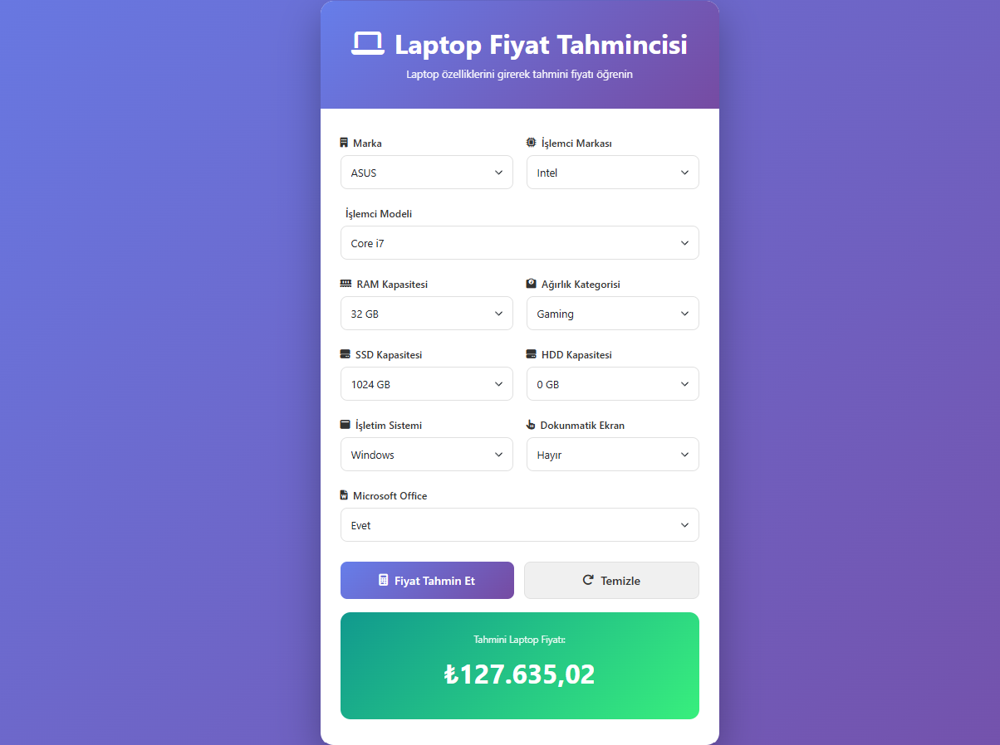

# 💻 Laptop Price Prediction / Laptop Fiyat Tahmini
Veri Bilimi ve Makine Öğrenimi 2025: 100 Günlük Kamp” kapsamında geliştirilen bu proje, veri hazırlama sürecinden modelin dağıtımına kadar tüm aşamaları içeren uçtan uca bir makine öğrenimi uygulamasıdır. Modern bir web arayüzü üzerinden çalışarak laptop fiyatlarını yapay zekâ ile tahmin etmeyi amaçlar.

## Örnek Resim


## Proje Yapısı

```
Laptop Price Predictor/
├── app.py                          # FastAPI uygulaması
├── LaptopPricePredictor.ipynb      # Model eğitim notebook'u
├── laptop_price_model.pkl          # Eğitilmiş model dosyası
├── laptopPrice.csv                 # Veri seti
├── requierments.txt                # Python bağımlılıkları
├── README.md                       
└── templates/
    └── index.html                  # Web arayüzü
```

## Hızlı Başlangıç

### 1️⃣ Gereksinimler
- Python 3.8+
- Windows/Mac/Linux

### 2️⃣ Kurulum Adımları

#### Windows PowerShell/CMD:

```powershell
git clone https://github.com/ensarakbas77/FinalProject.git "LaptopPrice"
cd LaptopPrice

# Python sanal ortamı oluşturun
python -m venv .venv

# Sanal ortamı etkinleştirin
.venv\Scripts\activate

# Gerekli paketleri yükleyin
pip install -r requierments.txt
```

#### macOS/Linux:

```bash
# Proje klasörüne gidin
cd "Laptop Price Predictor"

# Python sanal ortamı oluşturun
python3 -m venv venv

# Sanal ortamı etkinleştirin
source venv/bin/activate

# Gerekli paketleri yükleyin
pip install -r requierments.txt
```

### 3️⃣ Uygulamayı Çalıştırın

```powershell
# Sanal ortam aktif olduğundan emin olun
uvicorn app:app --reload
```

### 4️⃣ Tarayıcıda Açın

```
http://127.0.0.1:8000
```